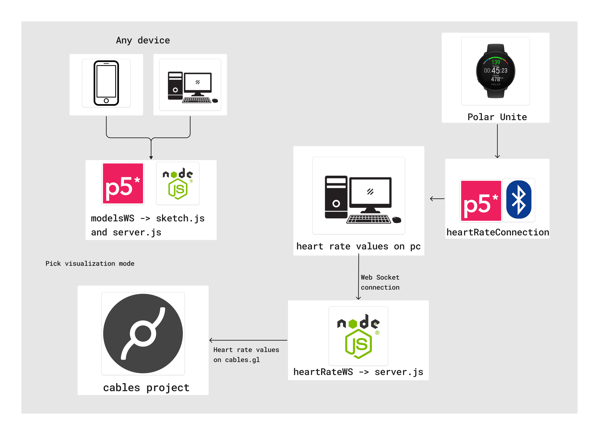
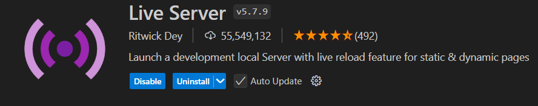

# Real-time heart rate visualization on cables.gl


This project enables an interactive visualization of heart rate data transmitted from a smartwatch (specifically, the Polar Unite) via Bluetooth. A p5.js application first connects the smartwatch to your device, capturing the heart rate values. These values are then sent to Cables.gl through a WebSocket connection. Using a second p5.js application and another WebSocket connection, the user can select the visualization mode for displaying the heart rate data on Cables.gl.

[Click here](https://cables.gl/p/pMsdcr) to view the material on Cables.gl.

## Structure


## Dependencies

To run this project, you need to install the following dependencies and meet these requirements:

1. **Install Node.js**
This project requires Node.js (which includes npm) for running the WebSocket server. You can check if Node.js is installed by running in your terminal:
```
node -v
```
If you don't have Node.js in your system you can download it [here](https://nodejs.org/en/download/package-manager).
After downloading it, install *ws* Library:

2. **ws Library for Node.js**

```
npm install ws
```

3. **LiveServer plugin for Visual Studio Code**


This plugin will help you launching the p5.js applcations in your browser.

# Components

## 1. Smartwatch and heartRateConnection application

In this setup, we use a Polar Unite smartwatch to capture heart rate data, but any BLE-compatible smartwatch can work. The connection relies on Bluetooth Low Energy (BLE), which requires specific UUID (Universally Unique Identifier) values to identify the services and characteristics provided by the device.

Understanding UUIDs in BLE
In BLE, UUIDs are unique identifiers assigned to services and characteristics that a device can offer. A service UUID defines a particular feature or function (e.g., heart rate monitoring), while a characteristic UUID identifies a specific data point or attribute within that service (e.g., the heart rate value). These UUIDs are essential for establishing a connection and accessing data from BLE devices.

- Service UUID: Identifies the main feature or data service. For example, the heart rate service has a standard UUID: "0000180D-0000-1000-8000-00805F9B34FB".
- Characteristic UUID: Specifies the exact data point within a service. For heart rate data, the characteristic UUID is typically "00002a37-0000-1000-8000-00805f9b34fb". This characteristic provides real-time heart rate measurements.
>Note: Different devices may use unique UUIDs. Refer to the documentation of your smartwatch to confirm the correct UUIDs for its heart rate service and characteristic.

### Connecting to the Smartwatch via BLE in p5.js
With the UUIDs, we can establish a connection to the smartwatch and start receiving heart rate data. Below is the code in p5.js, which connects to the device, retrieves the heart rate characteristic, and listens for notifications when new data is available.

<details>
  <summary> BLE connection and notifications </summary>


```js
let mySocket;
let myValue = 0;
const serviceUuid = "0000180D-0000-1000-8000-00805F9B34FB"; // Heart Rate Service
const characteristicUuid = "00002a37-0000-1000-8000-00805f9b34fb"; // Heart Rate Measurement Characteristic

let myBLE;
let myCharacteristic;

function setup() {
  mySocket = new WebSocket("ws://localhost:8080");

  mySocket.onopen = function () {
    console.log("WebSocket is connected");
  };

  // Configure BLE connection
  myBLE = new p5ble();
  const connectButton = createButton("Connect and Start Notifications");
  connectButton.mousePressed(connectAndStartNotify);
}

function connectAndStartNotify() {
  myBLE.connect(serviceUuid, gotCharacteristics);
}

function gotCharacteristics(error, characteristics) {
  if (error) {
    console.log("error: ", error);
    return;
  }

  // Find the heart rate characteristic
  myCharacteristic = characteristics.find(c => c.uuid === characteristicUuid);

  if (myCharacteristic) {
    myBLE.startNotifications(myCharacteristic, handleNotifications, "custom");
    console.log("Heart rate notifications started");
  } else {
    console.log("Heart rate characteristic not found.");
  }
}

function handleNotifications(data) {
  myValue = data.getUint16(0); // Retrieves the heart rate value

  // Package data into JSON and send via WebSocket
  const dataToSend = JSON.stringify(myValue);
  if (mySocket.readyState === WebSocket.OPEN) {
    mySocket.send(dataToSend);
    console.log("Data sent: ", dataToSend);
  } else {
    console.log("WebSocket is not ready to send data");
  }
}

function stopNotifications() {
  myBLE.stopNotifications(myCharacteristic);
}
```
</details>
In this code is being used p5.ble.js library.

You need to open the folder heartRateConnection with Visual Studio Code. 
```
code .
```
Then, if you already installed Live Server on Visual Studio Code, you'll see a 'Go Live' option. Click it, and the application will launch in your browser. With this setup you're able to connect your smartwatch and transmit heart rate data.

##  WebSocket Server Setup (server.js)

The WebSocket server acts as a bridge, allowing the heart rate data captured by the `heartRateConnection` application in p5.js to be broadcast to other clients in real-time. This enables synchronized updates across connected applications, Cables.gl in this case.

### Setting up the WebSocket Server

<details>
  <summary> server.js </summary>

  ```js
  const WebSocket = require('ws');

  const wss = new WebSocket.Server({ port: 8080 });

  wss.on('connection', (ws) => {
    console.log('Client connected');

    ws.on('message', (message) => {
      console.log('Received from client: %s', message);

      // Broadcast the message to all connected clients
      wss.clients.forEach((client) => {
        if (client.readyState === WebSocket.OPEN) {
          client.send(message);
        }
      });
    });

    ws.on('close', () => {
      console.log('Client disconnected');
    });
  });

  console.log('WebSocket server is running on ws://localhost:8080');
```
</details>

The server listens on ws://localhost:8080, allowing clients to connect. This port should match the one specified in the heartRateConnection application. When the `heartRateConnection` app sends a heart rate value, the server logs the message and forwards it to all connected clients. This broadcast functionality ensures that any client listening to the WebSocket (such as the Cables.gl visualization) receives the updated heart rate in real-time.


In the `heartRateConnection` application, the WebSocket connection is initialized with:

```js
mySocket = new WebSocket("ws://localhost:8080")
```

>Note: This example is configured to run locally on ws://localhost:8080. To make it accessible globally, simply replace localhost with your server's IP address or domain name.

Once the heart rate data is received from the smartwatch, it is formatted as JSON and sent through this WebSocket connection:
```js
const dataToSend = JSON.stringify(myValue);
if (mySocket.readyState === WebSocket.OPEN) {
  mySocket.send(dataToSend);
}
```
This sends the heart rate data to the WebSocket server, which in turn broadcasts it to all clients connected on ws://localhost:8080.

### Starting the WebScocket connection

Start the WebSocket Server: Run the server with Node.js by executing in modelsWS folder in your terminal:
```
node server.js
```
You should see a message indicating that the WebSocket server is running and if you already launch the `heartRateConnection` application and connect your smarwatch you must see messages like "Client connected" and the heart rate values in console. If additional clients (like Cables.gl) are connected to the WebSocket server, they should also receive the broadcasted heart rate data in real-time

## Receiving data on Cables.gl: WebSocket and MyWebSocket operators

To receive and handle real-time heart rate data in Cables.gl, we use WebSocket operators. Here’s an overview of the standard WebSocket operator and the custom `MyWebSocket` operator created for enhanced data handling.

### WebSocket Operator in Cables.gl

The built-in WebSocket operator in Cables.gl allows for straightforward data reception over WebSocket connections. This operator connects to a specified WebSocket URL and retrieves data sent by the heartRateConnection p5.js application. It is effective for receiving simple messages but has limitations in handling complex data types, like JSON or Blob, which are often used in real-time data transmission.
I tried to use this operator, but the data was received in Blob format, which is incompatible with it.

### MyWebSocket Operator

To overcome these limitation,  MyWebSocket operator was developed with additional functionalities. This operator enables a more robust WebSocket connection, with custom handling for JSON validation and Blob conversion. This operator also checks the connection status every 2 seconds and attempts to reconnect if disconnected.

<details>
  <summary> MyWebSocket </summary>

```js
const
    inUrl = op.inString("URL"),
    outResult = op.outObject("Result"),
    outValidJson = op.outBoolNum("Valid JSON"),
    outConnection = op.outObject("Connection", null, "Websocket"),
    outConnected = op.outBoolNum("Connected"),
    outReceived = op.outTrigger("Received Data"),
    outRaw = op.outString("Raw Data");

let connection = null;
let timeout = null;
let connectedTo = "";

inUrl.onChange = connect;
timeout = setTimeout(checkConnection, 2000);

inUrl.set();

let connecting = false;

function checkConnection() {
    if (!outConnected.get() && !connecting) {
        connect();
    }

    timeout = setTimeout(checkConnection, 2000);
}

op.onDelete = function () {
    if (outConnected.get()) connection.close();
    connecting = false;
    clearTimeout(timeout);
};

function connect() {
    op.setUiError("connection", null);
    op.setUiError("jsonvalid", null);

    if (outConnected.get() && connectedTo == inUrl.get()) return;

    if (inUrl.get() && inUrl.get().indexOf("ws://") == -1 && inUrl.get().indexOf("wss://") == -1) {
        op.setUiError("wrongproto", "only valid protocols are ws:// or wss:// ");
        return;
    } else {
        op.setUiError("wrongproto", null);
    }

    if (!inUrl.get() || inUrl.get() === "") {
        op.logWarn("websocket: invalid url ");
        outConnected.set(false);
        return;
    }

    window.WebSocket = window.WebSocket || window.MozWebSocket;

    if (!window.WebSocket)
        return op.logError("Sorry, but your browser doesn't support WebSockets.");

    op.setUiError("websocket", null);

    try {
        connecting = true;
        if (connection !== null) connection.close();
        connection = new WebSocket(inUrl.get());
    } catch (e) {
        if (e && e.message) op.setUiError("websocket", e.message);
        op.logWarn("could not connect to", inUrl.get());
        connecting = false;
    }

    if (connection) {
        connection.onerror = function (e) {
            connecting = false;
            outConnected.set(false);
            outConnection.set(null);
        };

        connection.onclose = function (message) {
            connecting = false;
            outConnected.set(false);
            outConnection.set(null);
        };

        connection.onopen = function (message) {
            connecting = false;
            outConnected.set(true);
            connectedTo = inUrl.get();
            outConnection.set(connection);
        };

        connection.onmessage = function (message) {
            op.setUiError("jsonvalid", null);

            // Check if the received data is of type Blob
            if (message.data instanceof Blob) {
                op.log("Received a Blob, converting to text...");
                const reader = new FileReader();
                reader.onload = function() {
                    try {
                        const json = JSON.parse(reader.result);  // Attempt to parse as JSON
                        op.log("Valid JSON received from Blob: ", json);
                        outResult.setRef(json);  // Set JSON as output
                        outValidJson.set(true);
                        outRaw.set(reader.result);  // Display raw string in "Raw Data" output
                    } catch (e) {
                        op.log("Not valid JSON from Blob: ", e);
                        outValidJson.set(false);
                        outRaw.set(reader.result);  // Display raw string in "Raw Data" output
                    }
                };
                reader.readAsText(message.data);  // Convert Blob to text
            }

            // Check if the received data is a string
            else if (typeof message.data === 'string') {
                op.log("Received as string: ", message.data);

                try {
                    const json = JSON.parse(message.data);  // Attempt to parse as JSON
                    op.log("Valid JSON received: ", json);
                    outResult.setRef(json);  // Set JSON as output
                    outValidJson.set(true);
                } catch (e) {
                    op.log("Not valid JSON: ", e);
                    outValidJson.set(false);
                }

                outRaw.set(message.data);  // Display raw string in "Raw Data" output
            }

            // If it is neither Blob nor string
            else {
                op.log("Received unexpected data, converting to string...");
                outRaw.set(JSON.stringify(message.data));  // Convert any other data type to string
                outValidJson.set(false);
            }

            outReceived.trigger();  // Trigger when data is received
        };
    }
}

```
</details>


## Visualization mode: modelsWS

The modelsWS component is a p5.js application that allows users to choose different visualization modes for displaying the heart rate data in Cables.gl. This component connects to a WebSocket server on ws://localhost:3000 and sends a value based on clicked square. This identifier is broadcast Cables.gl, which adjusts its display accordingly.


The WebSocket server is set up in server.js to listen on ws://localhost:3000 and handle incoming messages from the modelsWS component. Then, you also need to, inside `modelsWS` folder write in console: 

```
node server.js
```

With this step the project's setup is done.


## Interaction with cables.gl

When heart rate values are received in Cables.gl, they are processed through operators that use functions like mapRange to scale the values according to visualization needs. These scaled values are then connected to specific parameters within each visualization mode, allowing visual elements to respond dynamically as the heart rate increases or decreases. If you don't have a smartwatch connected or would like to test the visuals, I included some operators within Cables.gl to simulate heart rate values. You can adjust these manually to see the changes in real time across different visualization modes.

## Credits 

Each visualization mode was inspired by references or remixes within the Cables.gl community: 

1. [Particles](https://cables.gl/p/2cfsIh) by b2renger.
2. [Reaction Diffusion and Isolines](https://cables.gl/p/jpADMp) by zuggamasta.


